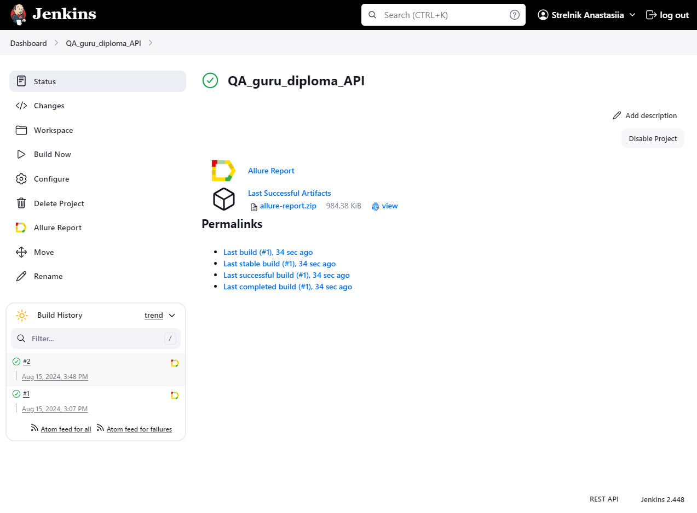
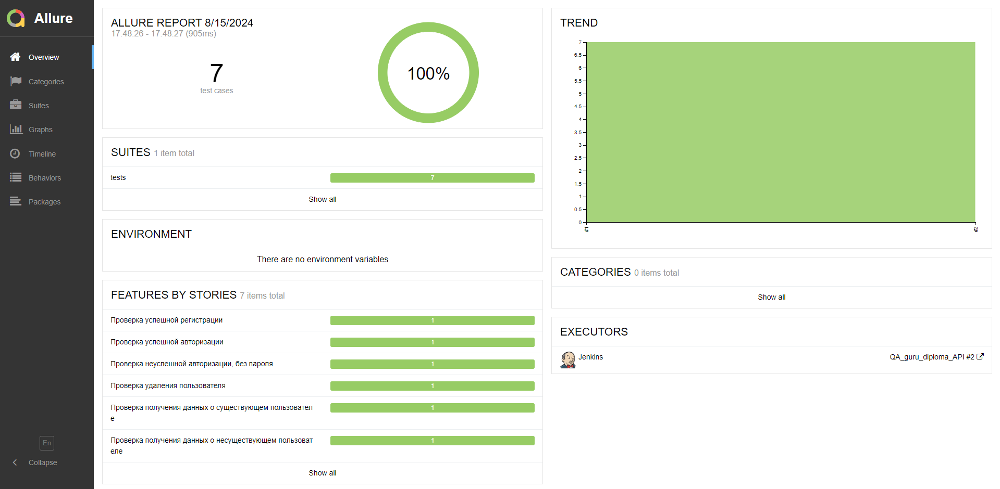
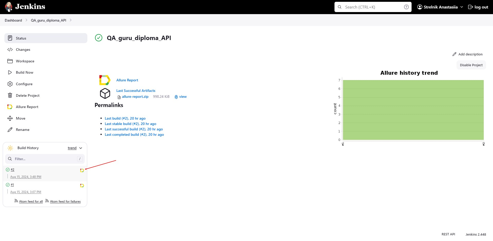
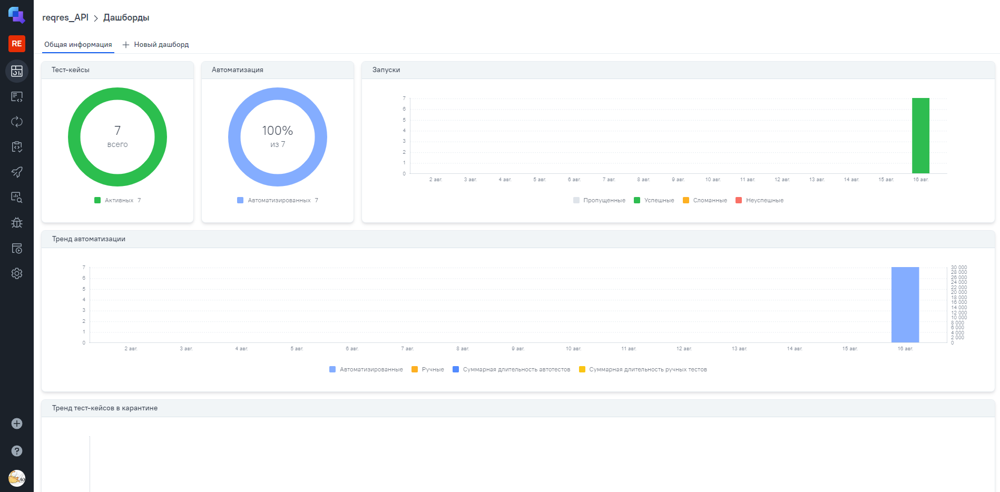

# Пример проекта API автотестов

###  Используемые технологии
<p align="center">
  <code></code>
  <code></code>
  <code></code>
  <code></code>
  <code></code>
  <code></code>
  <code></code>
  <code></code>
</p>

## Покрываемый функционал
- Проверка валидации полей при регистрации/авторизации
- Обработка запросов с невалидными данными
- Создание/удаление пользователей

## Запуск тестов
#### Все API тесты можно запустить как удалённо (Jenkins), так и локально

### Локально

Для запуска тестов локально, нужно выполнить следующие шаги
1. Склонировать репозиторий
2. Открыть проект в PyCharm
3. Ввести в териминале следующие команды
``` 
python -m venv .venv
source .venv/bin/activate
pip install -r requirements.txt
context=api pytest -m api  
```

### С помощью [Jenkins](https://jenkins.autotests.cloud/job/QA_guru_diploma_API/)
#### Для запуска автотестов необходимо:
 - Открыть [джобу](https://jenkins.autotests.cloud/job/QA_guru_diploma_API/) в jenkins
 - Нажать на Build


## Отчет о прохождении тестов (Allure)

### Локально
Для получения отчета нужно:
 - Запустить тесты
 - Ввести команду 
```
allure serve allure-results
```
Ниже представлен пример allure отчета 


### Если тесты запускались в Jenkins

Для получения отчета нужно нажать на иконку allure report'a в строке билда 

У него будет точно такой же формат, как и при получении локально


### В проекте реализована интеграция с Allure TestsOps

